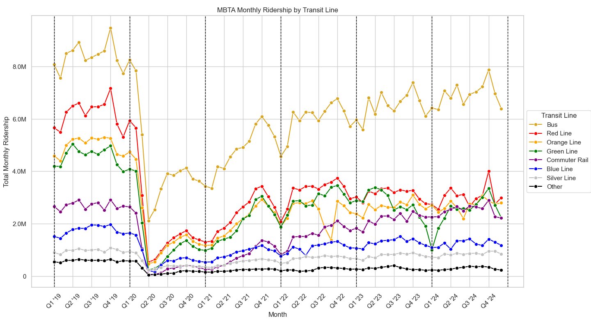
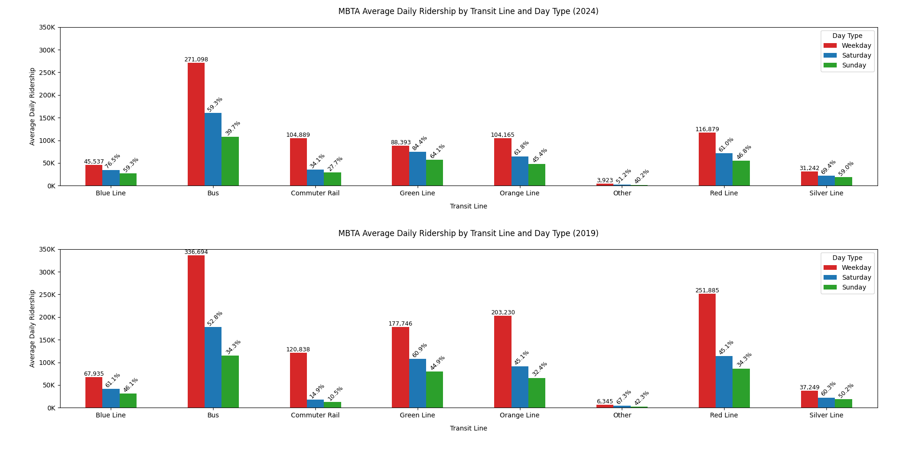
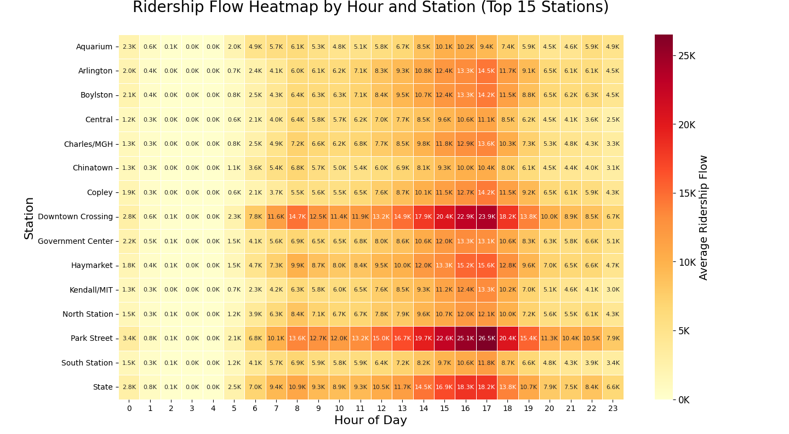
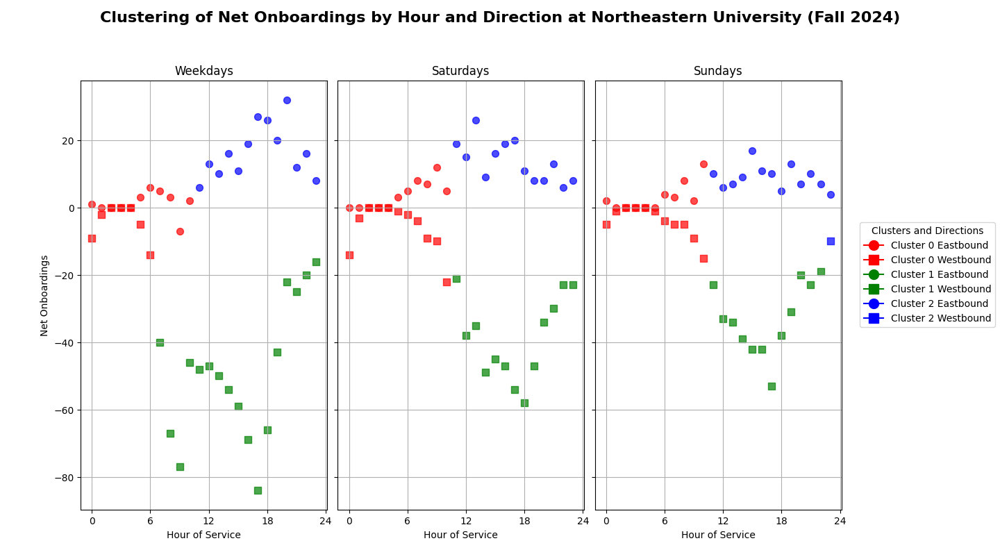
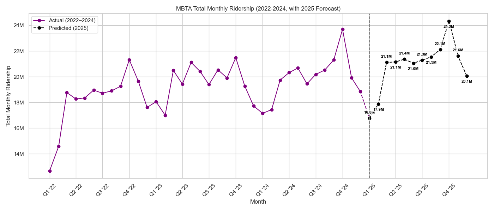

# MBTA Ridership Analysis & Forecasting

## Overview

This project analyzes MBTA ridership patterns to understand how transit usage has changed over time, how ridership varies across service lines and days of the week, and when and where passenger activity is most concentrated.

Using MBTA ridership data from 2019–2024, our team applied exploratory data analysis, time-series modeling, clustering, and visualization techniques in Python. The project concludes with a 2025 ridership forecast incorporating both long-term trends and seasonal patterns.

I served as the project lead, helping define the analytical direction, select datasets and methods, develop the Python analyses and visualizations, and integrate the team's work into a cohesive final analysis. This was completed as a team project for an undergraduate Intermediate Programming with Data course at Northeastern University.

## Research Questions

The project explored several questions:

- How has MBTA ridership changed since 2019?
- How has transit usage recovered following the COVID-19 disruption?
- How do weekday and weekend ridership patterns differ?
- Which transit lines and stations experience the greatest passenger activity?
- How does ridership vary throughout the day?
- Can recent trends and seasonal patterns be used to forecast future ridership?

## Data

The analysis uses public MBTA ridership datasets covering:

- Monthly ridership by transit mode and line
- Hourly rail ridership by station and direction
- Boarding and offboarding activity
- Weekday, Saturday, and Sunday service patterns
- Commuter Rail ridership

The primary analysis covers 2019–2024, with more recent 2022–2024 data used to construct the 2025 forecast.

## Methods

The analysis was conducted in Python and included:

- Data cleaning and transformation with Pandas and NumPy
- Exploratory data analysis
- Time-series and seasonal analysis
- STL seasonal-trend decomposition
- Linear trend modeling
- K-means clustering
- Feature standardization
- Weighted-average comparisons
- Hourly passenger-flow analysis
- Data visualization with Matplotlib and Seaborn

## Long-Term Ridership Trends

MBTA ridership declined sharply during the COVID-19 pandemic before gradually recovering. By 2024, overall ridership remained below 2019 levels, although recovery patterns varied considerably across transit lines and different types of service.

## Weekday vs. Weekend Ridership

Comparing 2019 and 2024 revealed changes in how riders use the MBTA throughout the week. While overall ridership remained lower, weekend ridership represented a larger percentage of weekday usage in 2024 for several transit modes.

## Hourly Station Flow

Station-level hourly data was used to identify where and when passenger traffic is most concentrated. Major downtown transfer stations consistently experienced some of the highest flows, particularly during afternoon and evening peak periods.

## K-Means Analysis

K-means clustering was used to explore hourly boarding patterns at Northeastern University station. Observations were clustered using hour of service and net onboardings, helping identify distinct ridership patterns across time of day and travel direction.

## 2025 Ridership Forecast

To model future ridership, monthly data from 2022–2024 was decomposed using STL (Seasonal-Trend decomposition using LOESS).

A linear model was fitted to the underlying trend, while historical monthly seasonal effects were incorporated into the final 2025 predictions.

The model projected continued ridership growth with substantial seasonal variation and estimated a peak of approximately **24.3 million monthly rides in October 2025**.

## Key Findings

- MBTA ridership experienced a major structural decline during the COVID-19 pandemic followed by a gradual multi-year recovery.
- Ridership recovery varied substantially across transit modes.
- Weekend ridership represented a larger share of weekday ridership in 2024 than in 2019 for several modes.
- Passenger activity showed distinct morning and afternoon/evening patterns, with weekday travel displaying the strongest commute-related peaks.
- Major downtown stations such as Park Street and Downtown Crossing experienced some of the highest passenger flows.
- K-means clustering revealed distinct hourly and directional ridership patterns around Northeastern University.
- Time-series modeling projected continued growth during 2025 while preserving strong seasonal variation.

## Project Files

### Analysis
- `predictive.py` — STL decomposition and 2025 ridership forecasting
- `monthly_ridership.py` — long-term ridership trends by transit line
- `yearly_trends.py` — year-over-year ridership analysis
- `mbta_ridership_by_day.py` — weekday and weekend ridership comparison
- `service_hours.py` — hourly boarding and offboarding analysis
- `kmeans_analysis.py` — K-means analysis of Northeastern University ridership
- `station_flow_analysis.py` — station-level passenger flow analysis
- `station_flow_heatmap.py` — hourly station flow visualization

### Supporting Files
- `final_report.pdf` — complete project report
- Source CSV files — public MBTA ridership datasets used throughout the analysis

## Tools

**Python** | Pandas | NumPy | Matplotlib | Seaborn | scikit-learn | Statsmodels | K-Means Clustering | STL Decomposition | Time-Series Analysis | Forecasting
